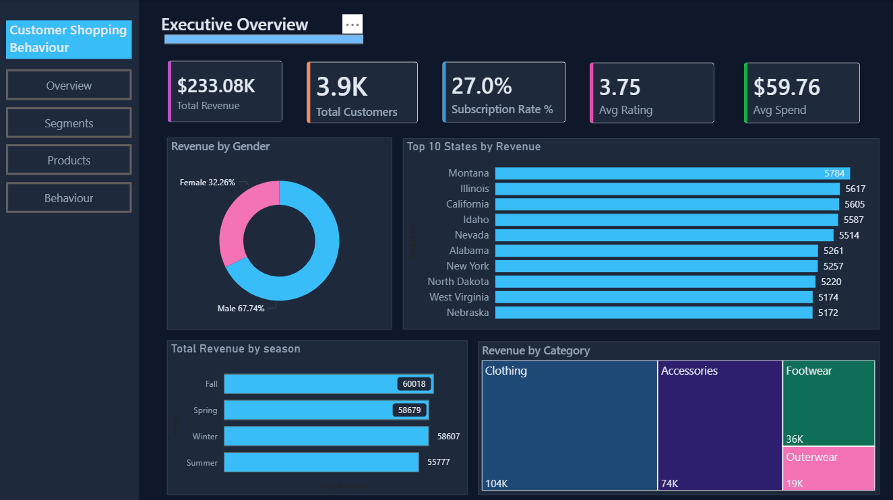
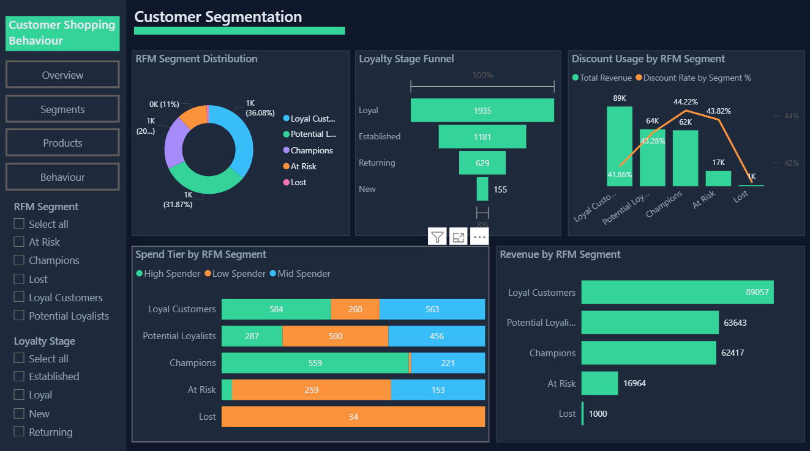
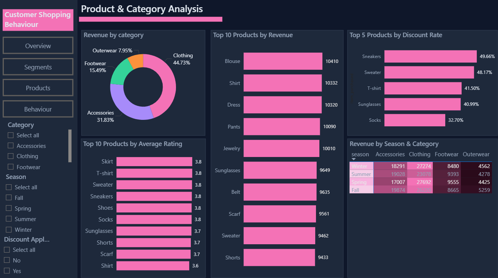
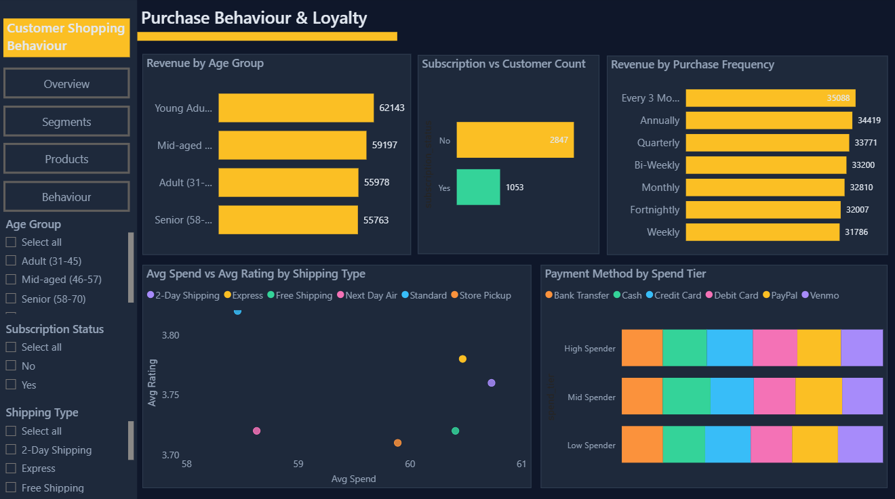

# 🛍️ Customer Shopping Behaviour Analytics

## 📊 Project Overview
This project analyses customer shopping behaviour data to explore revenue patterns, 
customer segmentation, product performance, and purchase habits.

Using Python for data preprocessing, feature engineering and machine learning, 
MySQL for structured KPI analysis, and Power BI for interactive visualization, 
the project transforms raw shopping data into meaningful business insights.

The dashboard enables users to quickly explore customer demographics, RFM segments, 
product trends, and loyalty behaviour — supporting data-driven retail decision making.

---

## 🎯 Business Problem
Understanding customer behaviour is critical for retail businesses. 
Companies need effective tools to identify their most valuable customers, 
understand what products are performing well, and recognise patterns 
in purchasing habits across different demographics and seasons.

However, raw transactional data is often complex and difficult to interpret. 
This project addresses this challenge by developing an end-to-end analytics 
pipeline — from raw data to an interactive dashboard — that simplifies 
exploration of customer data and highlights key patterns related to 
revenue, loyalty, and product performance.

---

## 🗂 Dataset
The dataset contains shopping records of 3,900 customers with 18 original 
features, enriched to 28 features through Python feature engineering.

📄 Dataset File: customer_shopping_behaviour_analytics.csv

### Key Features
- Customer Demographics: Age, Gender, Location
- Purchase Details: Item Purchased, Category, Purchase Amount, Season
- Behaviour: Review Rating, Subscription Status, Discount Applied,
  Payment Method, Shipping Type, Previous Purchases
- Engineered Features: RFM Scores, RFM Segment, Loyalty Stage,
  Spend Tier, Age Group, KMeans Cluster

---

## 🛠 Tools & Technologies
- **Python** — Data cleaning, EDA, feature engineering, KMeans clustering
- **MySQL** — 20 KPI queries using CTEs and window functions
- **Power BI** — 4-page interactive dashboard with DAX measures
- **Jupyter Notebook** — Code development and analysis environment
- **GitHub** — Project documentation and portfolio showcase

---

## 🔎 Python Analysis

Before building the dashboard, data preprocessing and EDA were performed 
using Python to clean and enrich the dataset.

📄 Notebook: customer_shopping_behaviour_analytics.ipynb

### Analysis Included
- Data cleaning and preprocessing
- Missing value inspection
- Distribution analysis of age, spend and review rating
- Exploratory data analysis with visualisations
- Feature engineering:
  - Age group binning
  - Spend tier classification (Low · Mid · High)
  - RFM scoring (Recency, Frequency, Monetary)
  - Customer loyalty staging (New → Returning → Established → Loyal)
  - KMeans clustering (Budget · Mid Range · High Value)

---

## 🗄 SQL Analysis

20 KPI queries were written to analyse the enriched dataset in MySQL.

📄 SQL File: customer_shopping_behavior_analytics.sql

### Key Queries
| # | Analysis |
|---|---|
| Q7 | Customer segmentation by purchases (CTE) |
| Q8 | Top 3 products per category (CTE + Window Function) |
| Q12 | Discount usage rate by RFM segment |
| Q13 | Behaviour changes across loyalty stages |
| Q20 | Top 5 spenders per RFM segment (RANK + Window Function) |

---

## 📈 Dashboard Features

📄 Power BI File: customer_shopping_behaviour_analytics.pbix

### Page 1 — Executive Overview
This page provides a high-level summary of overall business performance.

**Key Metrics**
- Total Revenue: $233,081
- Total Customers: 3,900
- Avg Spend: $59.76
- Avg Review Rating: 3.75
- Subscription Rate: 27.0%
- Discount Usage Rate: 43.0%

**Visual Analysis**
- Revenue by Gender
- Revenue by Season
- Revenue by Category
- Top 10 States by Revenue

---

### Page 2 — Customer Segmentation
This page focuses on RFM segmentation, loyalty stages and ML clustering.

**Visual Analysis**
- RFM Segment Distribution
- Loyalty Stage Funnel
- Discount Usage by RFM Segment
- Spend Tier by RFM Segment
- Revenue by RFM Segment

---

### Page 3 — Product & Category Analysis
This page explores product performance, ratings and seasonal trends.

**Visual Analysis**
- Revenue by Category
- Top 5 Products by Average Rating
- Top 10 Products by Revenue
- Top 5 Products by Discount Rate
- Revenue Heatmap — Season × Category

---

### Page 4 — Purchase Behaviour & Loyalty
This page analyses how customers behave across age groups, 
payment methods, shipping types and purchase frequency.

**Visual Analysis**
- Revenue by Age Group
- Subscription vs Customer Count
- Avg Spend vs Rating by Shipping Type
- Payment Method by Spend Tier
- Revenue by Purchase Frequency

---

## 💡 Key Insights
- **Loyal Customers** generate the most revenue at **$89,057**
- **Fall** is the highest revenue season at **$60,018**
- **Clothing** dominates category revenue at **44.73%** ($104K)
- **Champions** have the highest discount usage rate at **44.22%**
- **Montana** is the top state by revenue at **$5,784**
- **Male** customers dominate revenue at **67.74%** vs Female **32.26%**
- **Non-subscribers** significantly outnumber subscribers (**2,847 vs 1,053**)
- **Lost** customers are almost entirely Low Spenders
- **Young Adults** generate the highest revenue at **$62,143**
- **Blouse** is the top product by revenue at **$10,410**
- **Sneakers** have the highest discount rate at **49.66%**
---

## 🖼 Dashboard Preview

### Page 1 — Executive Overview

### Page 2 — Customer Segmentation

### Page 3 — Product & Category Analysis

### Page 4 — Purchase Behaviour & Loyalty

---

## 📚 Data Source & License

The dataset used in this project was obtained from Kaggle:
https://www.kaggle.com/datasets/sahilislam007/shopping-trends-and-customer-behaviour-dataset

* License: CC0:Public Domain
* This project is created for educational and portfolio purposes only.
* The analysis presented in this repository is intended to demonstrate
  data analytics skills across Python, MySQL and Power BI.
